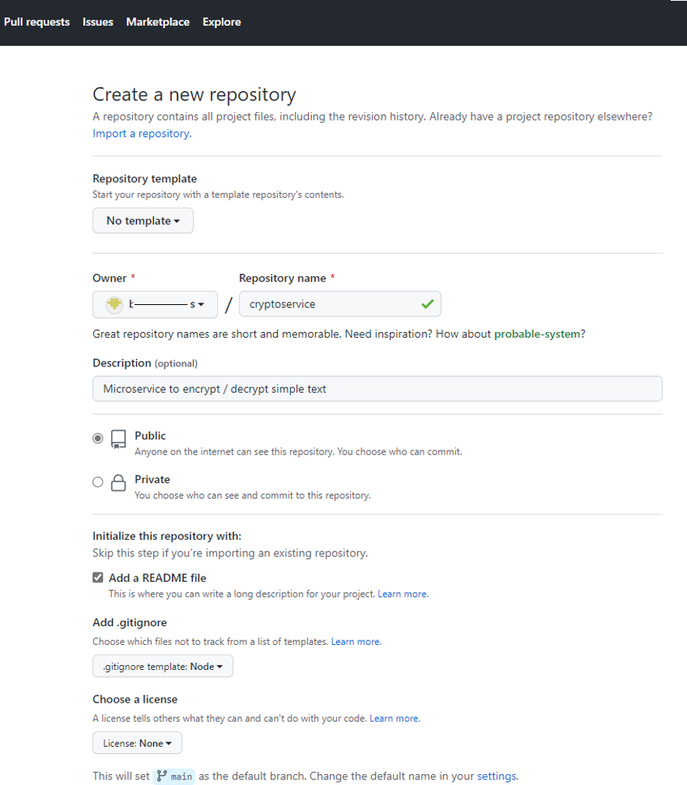
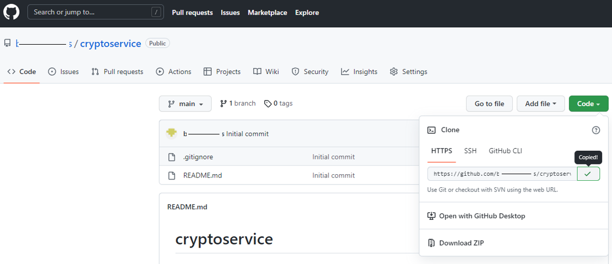
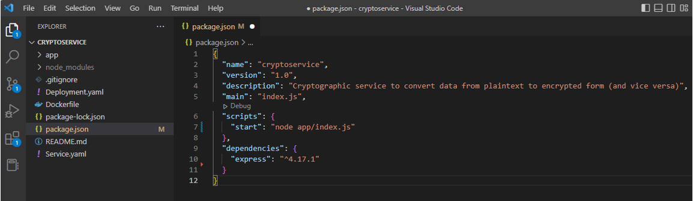
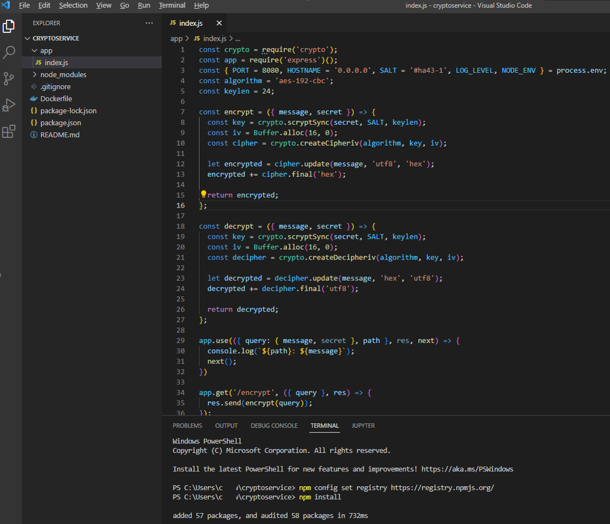
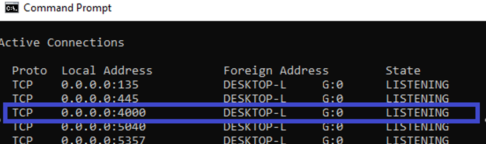
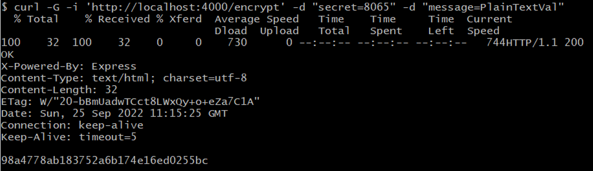
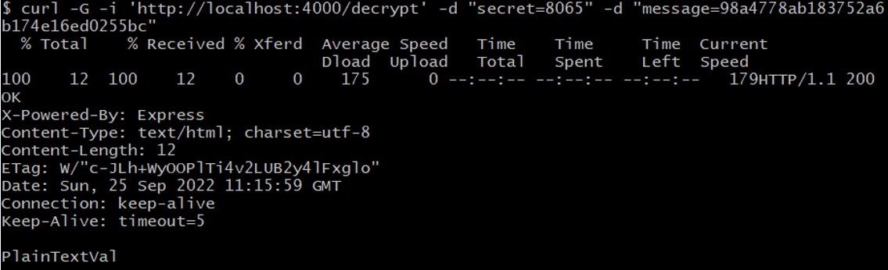
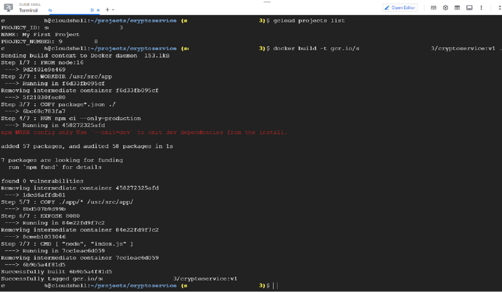
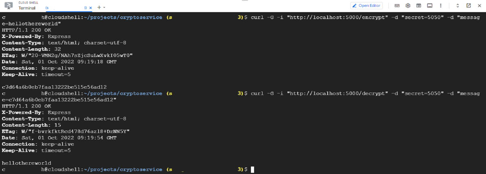

# Crypto Service

Simple Express service (Node.js encrypt/decrypt) demonstrating build, deployment and hosting of a simple *standalone* service in Kubernetes Engine (GCloud)

Important 1) Steps here are a prerequisite:

[Registration Service Mesh Setup](https://github.com/burningglass/registrationservicemeshsetup)

Important 2) Familiarity with this project will ease tackling the more advanced service projects:

[Registration Store](https://github.com/burningglass/registrationstore)<br/>
[Registration Web(GUI)](https://github.com/burningglass/registrationgui)

## 2 Repo set-up

### 2.1 Create an empty Repo (in GitHub)

Your repo can be Public or Private:



### 2.2 Copy Repo location to clipboard



### 2.3 Create the parent working folder

On the local Desktop (using the Command Prompt):

`cd %HOMEPATH%`</br>
`mkdir projects`</br>
`cd projects`

### 2.4 Clone the repo

`git clone <paste>` (i.e. URL copied into Clipboard from GitHub above)

## 3 Write the code

### 3.1 IDE launch

`cd %HOMEPATH%\projects\cryptoservice`<br/>
`code .` (to launch VS Code in the context of this project folder)

### 3.2 Create Package.json

Using your preferred Terminal create this file:

`npm init`

Edit package.json to add the 'express' dependency:



Back in Terminal, install the package dependencies (i.e. initially installs just 'express' and its dependencies):

`npm config set registry https://registry.npmjs.org`</br>
`npm install`

### 3.3 Create the main script

Now code the main script (index.js):



### 3.4 Run the service

The following commands start this Node.js app (which is Javascript, therefore interpreted code when its end-points are invoked - on port 4000 in this case):

*In Windows*<br/>
`set PORT=4000`<br/>
`npm start`

*In MacOS*<br/>
`PORT=4000 npm start`

Now open a separate Terminal to check the service is listening on its http end-points:

`netstat -a`<br/>
or<br/>
`netstat -a | find 4000`



### 3.5 Test the service

CURL to encrypt data (a string in plain text):



CURL to decrypt (using encrypted string from above):



## 4 Update the repo

### 4.1 Set contributing-user properties (if necessary)

Under `%HOMEPATH%\projects\cryptoservice`:<br/>
`git config --global user.name "<ContributorName>"`<br/>
`git config --global user.email "<ContributorEmailAddress>"`

### 4.2 Push code and config back to GitHub

Under `%HOMEPATH%\projects\cryptoservice`:<br/>
`git add app/index.js`<br/>
`git add package.json`<br/>
`git add package-lock.json`<br/>
`git commit -m "Initial bulk (Crypto service) code upload"`<br/>
`git push`<br/>

## 5 Dockerize the app (in GCloud)

### 5.1 Connect to K8s context in GCloud:


### 5.2 Connect to the K8s cluster:


### 5.3 Create the parent working folder (GCloud Shell environment):

`cd ~`<br/>
`mkdir projects`<br/>
`cd projects`

### 5.4 Clone the Repo (from GitHub):

`git clone <paste>` (i.e. URL copied to clipboard in 2.2)

### 5.5 Switch to project folder:

`cd cryptoservice`

### 5.6 Enable Docker in GCloud:

`gcloud auth configure-docker`

### 5.7 Create and build the Dockerfile

If necessary, based on: 

[Dockerfile](https://github.com/burningglass/cryptoservice/blob/main/Dockerfile)<br/>

The Docker build:

`gcloud projects list` yields PROJECT_ID<br/>

`docker build -t gcr.io/[PROJECT_ID]/cryptoservice:v1.0.0 .` builds the container image:



### 5.8 Check the local (Docker) Registry

`docker image ls` reveals the newly-built image (above) showing its <image id>

### 5.9 Start and verify service in GCloud Shell

The following command creates container <container name> "cryptoservicecontainer" and starts it:

`docker run -d -i -t -p:5000:8080 --name cryptoservicecontainer <image id>`<br/>

- It will be inwardly listening on 8080
- It will be outwardly listening on 5000

Check the container is running:

`docker container ls`<br/>

Note. how this container (i.e. instance of the image) is:

1. Running in the background
2. Shows the host and ports it is listening on
3. Identified by the container name given

It is also possible to check the app service's listening port using netstat:

`netstat -a | grep 5000` should yield one line showing it is outwardly listening

### 5.10 Terminal into container

The following works...<br/>

`docker exec -it <container name> /bin/bash`<br/>

...because the docker container was started with the -i switch<br/>

Note. `-it` (docker run switch) allocates a pseudo-TTY connected to the container’s stdin<br/>

pseudo-TTY: A device that has the functions of a physical terminal without actually being one. Created by terminal emulators such as xterm<br/>

Now inside this container's filesystem:<br/>

`ls` reveals both folders of the base image (referenced by the Dockerfile) and the (app)service folder (the Dockerfile copied into the image): `/app`<br/>

`exit` exits out of this container

### 5.11 Test app service

The following command...<br/>

`curl -G -i "http://localhost:5000/encrypt" -d "secret=5050" -d "message=hellothereworld"`<br/>

...reveals this containerized version of the service works in the local GShell environment



### 5.12 Clean up

Not strictly necessary because GCloud Shell will clean up the workspace, but for learning purposes:<br/>

`docker container stop <container name>`<br/>

Now check the container has 'Exited':<br/>

`docker container ls -a`

And delete the container:<br/>

`docker container rm <container name>`<br/>

Note. Deleting the image is also possible (as follows), but **don't** because it will be installed into GCloud K8s (covered in the next section)<br/>

`docker image ls`<br/>
`docker image rm <image id>`

## 6 Deploy Crytoservice to K8s (in GCloud)

### 6.1 Reconnect to K8s context in GCloud:


### 6.2 Reconnect to the K8s cluster:


### 6.3 Push the Docker image to Google Container Registry

`docker push gcr.io/[PROJECT_ID]/cryptoservice:v1.0.0`

### 6.4 Verify the image is in the Registry

`gcloud container images list --repository gcr.io/[PROJECT_ID]`<br/>


Or launch the Container Registry service, by clicking the left-side service bar under GCloud's CI/CD section:


Note. You can see the active tag(s) for the uploaded image(s) with this command:

`gcloud container images list-tags gcr.io/[PROJECT_ID]/cryptoservice`

Note. You can see all information about the above image using:

`gcloud container images describe gcr.io/[PROJECT_ID]/cryptoservice:v1.0.0`

Note. The above image can be deleted using:

`gcloud container images delete gcr.io/[PROJECT_ID]/cryptoservice:v1.0.0`

Note. It is possible to prepend specific repository identifiers to the end of Docker image tags (e.g. gcr.io/[PROJECT_ID]/[REPO_ID]/myapp:v1.0.0), it is possible to list such images in Google Container Repository as follows:

`gcloud container images list --repository gcr.io/[PROJECT_ID]/[REPO_ID]`

### 6.5 Review the available K8s Nodes

To show general information about the whole cluster:

`kubectl cluster-info`

To show all Pods running across all namespaces (including the 'reserved' ones since some form part of the running Anthos(Istio) management layer):

`kubectl get pods -A`

Note. This sample uses the GCloud K8s Autopilot feature, hence Nodes (hosting the Pods) are automatically provisioned/ managed by the platform. In a regular cluster it is possible show information about Nodes with this command:

`kubectl get nodes`

### 6.6 Create the 'Deployment' configuration as .yaml

Back in the desktop environment (/source code project), add this new file to the root of the cryptoservice project:

```
apiVersion: apps/v1
kind: Deployment
metadata:
  name: cryptoservice
spec:
  replicas: 1
  selector:
    matchLabels:
      app: cryptoservice
  template:
    metadata:
      labels:
        app: cryptoservice
    spec:
      containers:
      - image: gcr.io/[PROJECT_ID]/cryptoservice:v1.0.0
        imagePullPolicy: Always
        name: main
      restartPolicy: Always
      terminationGracePeriodSeconds: 5
```

### 6.7 Create the 'Service' configuration as .yaml

Back in the desktop environment (/source code project), add this new file to the root of the cryptoservice project:

```
apiVersion: v1
kind: Service
metadata:
  name: cryptoservicesvc
spec:
  ports:
  - name: http
    port: 80
    targetPort: 8080
  selector:
    app: cryptoservice
  type: LoadBalancer
```

### 6.8 Commit and Push the new files to GitHub

`git add Deployment.yaml`<br/>
`git add Service.yaml`<br/>
`git commit -m "Added K8s installation/config artefacts"`<br/>
`git push`

### 6.9 Git Pull the two files (above) into your GShell ~/projects/cryptoservice project folder

Now returning to GCloud GShell:

`git pull`


### 6.10 Modify Deployment.yaml to set container image source location

`vi Deployment.yaml`

Override [PROJECT_ID] with specific GCloud project ID:


{ESCAPE} then : then wq then {RETURN}

### 6.11 Install Deployment.yaml to K8s (in GCloud):

`kubectl apply -f Deployment.yaml -n default`<br/>
`kubectl get pods -n default`

Note. -n specifies the K8s namespace (it's optional)

The Deployment will create an initial Pod (it will initially show 'ContainerCreating' state and eventually hit 'Running' state).

### 6.12 Install Service.yaml to K8s (in GCloud):

`kubectl apply -f Service.yaml -n default` <br/>
`kubectl get services -n default`

Note. -n specifies the K8s namespace (it's optional)

The Service will create a LoadBalancer (it will initially show '<pending>' state and eventually its (listening) EXTERNAL-IP)

This LoadBalancer will direct all traffic into the Pod above

### 6.13 Test the application hosted by K8s (in GCloud):

`curl -G -i “http://external_ip_addr>/encrypt” -d "secret=5050" -d "message=hellothereworld"`

### 6.14 Other K8s commands:

To get information about running Pods:

`kubectl get pod -n default` Note. -n specifies the K8s namespace (it's optional)

The following will restart the Deployment, restarting containers (in each (replica)Pod) one-by-one (keeping the overall application as alive as possible):

`kubectl rollout restart deployment -n default`

### 6.15 Anthos(Istio) should be active

This assumes prerequisite steps were implemented (see https://github.com/burningglass/registrationservicemeshsetup section 3)

i.e. The following command `kubectl get pod -n default` should reveal:


'2/2' indicates two containers running inside the Pod:
- the app
- the Anthos(Istio) sidecar


